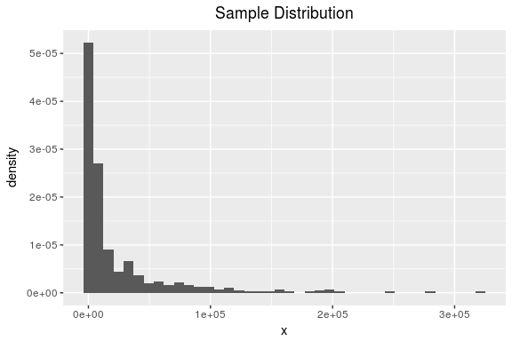
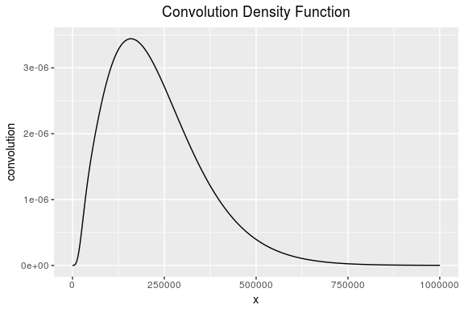
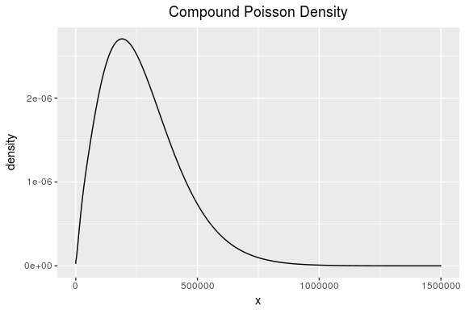

Introduction to `mixem`
-----------------------

Modelling losses is a problem of interest arising frequently in finance and actuarial science. Completely monotone densities have properties that make them well suited for modelling loss distributions. While parametric approaches are popular, they require rather strong assumptions about the data, and model misspecification can lead to serious inferential errors. Strictly nonparametric approaches tend to fit the data well but do not provide an appropriate amount of smoothing. In order to strike a balance between these two extremes one can take a semiparametric approach. It can be shown that completely monotone densities are equivalent to mixtures of exponential distributions. Although this places a parametric restriction on the estimation problem, no parametric assumption is required about the mixing measure. `mixem` implements the expectation-maximization (EM) algorithm to compute maximum likelihood estimates (MLEs) of completely monotone densities for situations when data is grouped, censored, and when no grouping or censoring of the data is present. These methods are easily extended with Fast Fourier Transform techniques for use in common aggregate loss models.

`mixem` Info
------------

`mixem` consists of three main functions `em_fit`, `em_group_fit`, and `em_censored_fit` that each obtain the MLEs of completely monotone densities when data is not grouped or censored, grouped, and censored respectively. In addition to finding the MLEs, the three functions above will also return an estimate of the optimal number of mixtures. Each function will continue to add a component to the mixture distribution as long as the log likelihood function continues to increase.

Ungrouped and Uncensored data
-----------------------------

In the plain vanilla situation where no grouping or censoring of the data is present, the function `em_fit` can be used to obtain the MLEs as well as an estimate of the optimal number of mixtures. The development of `em_fit` implements the EM algorithm as outlined in the paper by Jewell (1982).

Consider the following scenario where `n = 500` data points are generated from an exponential mixture distribution with rate parameters $\\lambda\_1 = \\frac{1}{500}, \\lambda\_2 = \\frac{1}{5000}, \\lambda\_3 = \\frac{1}{50000}$ and corresponding mixing proportions *p*<sub>1</sub> = 0.2, *p*<sub>2</sub> = 0.4, *p*<sub>3</sub> = 0.4

``` r
library(ggplot2)
library(scales)

set.seed(123)
n <- 500
components <- sample(1:3,
                     prob = c(0.2, 0.4, 0.4),
                     size = n,
                     replace = TRUE)
lambdas <- c(1/500, 1/5000, 1/50000)
x <- rexp(n, rate = lambdas[components])
ggplot(data = data.frame(x), aes(x))+ geom_histogram(aes(y=..density..), bins = 40) +
  ggtitle("Sample Distribution") +
  theme(plot.title = element_text(hjust = 0.5))
```



Now we can call `em_fit` to obtain MLEs.

``` r
fit <- em_fit(x)
fit
```

    ## $p
    ## [1] 0.3908942 0.4444357 0.1646701
    ## 
    ## $mean
    ## [1] 52489.2521  5081.1373   327.2984

Censored Data
-------------

When data is right censored, the function `em_censored_fit` can be called to obtain MLEs. The implementation of the EM algorithm in the paper by Chauveau (1995) is carried out in `em_censored_fit`.

Consider the same sample of data where `n = 500` data points are generated from an exponential mixture distribution with rate parameters $\\lambda\_1 = \\frac{1}{500}, \\lambda\_2 = \\frac{1}{5000}, \\lambda\_3 = \\frac{1}{50000}$ and corresponding mixing proportions *p*<sub>1</sub> = 0.2, *p*<sub>2</sub> = 0.4, *p*<sub>3</sub> = 0.4. But now, suppose the data is right-censored at 50000. In order to obtain the MLEs we need to pass the uncensored observations `x_uncensored`, censoring point `censoring_point`, and the number of right-censored data points `n_censored`.

``` r
x_censored <- ifelse(x>50000,'>50000',x)
x_censored <- as.numeric(x_censored)
```

    ## Warning: NAs introduced by coercion

``` r
x_uncensored <- x_censored[!is.na(x_censored)]
censoring_point <- 50000
n_censored <- length(x_censored[is.na(x_censored)])

em_censored_fit(x_uncensored, censoring_point, n_censored)
```

    ## $p
    ## [1] 0.1606611 0.4230559 0.4162830
    ## 
    ## $mean
    ## [1]   320.0066  4697.2956 46350.0959

Grouped Data
------------

For situations when the data is grouped, you can call `em_grouped_fit` to obtain MLEs. The development of `em_grouped_fit` implements the EM algorithm as outlined in the paper by McLachlan and Jones (1988).

As an example, we'll group the same data we've been working with into 150 equal sized groups. Since `max(x) =`321094.2, we can set the max upper boundary as 322, 000 and proceed with the grouping as follows:

`r   boundaries <- 322000/150*0:150   x_grp <- cut(x,breaks = boundaries)`

We can call `em_grouped_fit` on this data directly by specifying `data_type = interval`.

``` r
em_group_fit(x_grp = x_grp, data_type = "interval")
```

    ## $p
    ## [1] 0.3790364 0.2985611 0.1409999 0.1814027
    ## 
    ## $lambda
    ## [1] 1.867434e-05 1.572765e-04 2.418987e-04 2.278562e-03
    ## 
    ## $means
    ## [1] 53549.4194  6358.2289  4133.9618   438.8732

If the data is in a cross tab format, then choose `data_type = cross tab`.

``` r
x_tab <- table(x_grp)
em_group_fit(x_grp = x_tab, data_type = "cross tab")
```

Data in tabular format is also supported. The table needs to be in a format such that the first two columns represent the lower and upper bounds of the group, and the third column is the count of obervations in each group.

| Lower group boundary | Upper group boundary | Count |
|----------------------|----------------------|-------|
| 0                    | 2,150                | 169   |
| 2,150                | 4,290                | 51    |
| ...                  | ...                  | ...   |
| 320,000              | 322,000              | 1     |

Then `em_grouped_fit` can be called with `data_type = "tabular"`.

``` r
em_group_fit(x_grp = table_data, data_type = "tabular")
```

Completely Monotone Densities in Aggregate Loss Models
------------------------------------------------------

In aggregate loss models we are interested in the distribution of the sum *S* = *X*<sub>1</sub> + *X*<sub>2</sub> + ... + *X*<sub>*m*</sub> where the *X*<sub>*i*</sub> are independent and identically distributed with probability density function *f*. In order to estimate *f*<sub>*S*</sub> the probabilty density function of the random variable *S* we can use the methodology outlined in Chesneau et al. (2015) that uses the Fast Fourier Transform to estimate the m-fold convolution of the density *f*.

Recall from earlier we used `em_fit` to estimate the completely monotone density *f* parametrized by $\\lambda\_1 = \\frac{1}{500}, \\lambda\_2 = \\frac{1}{5000}, \\lambda\_3 = \\frac{1}{50000}$ and corresponding mixing proportions *p*<sub>1</sub> = 0.2, *p*<sub>2</sub> = 0.4, *p*<sub>3</sub> = 0.4. If we want to now estimate the m-fold convolution of *f* where *m* = 10, we simply do the following:

``` r
density <- m_fold_convolution(m = 10, lambda = 1/fit$mean, p = fit$p,
                              xmax = 1e+6, N = 2^21)
ggplot(data = data.frame(density), aes(x = x, y = convolution)) + geom_line() +
  ggtitle("Convolution Density Function") +
  theme(plot.title = element_text(hjust = 0.5))
```



With `m_fold_convolution` in hand, we can estimate other common distributions used to model aggregate losses such as the compound Poisson distribution. The compound Poisson distribution again considers the sum *S* = *X*<sub>1</sub> + *X*<sub>2</sub> + ... + *X*<sub>*N*</sub> where the *X*<sub>*i*</sub> are independent and identically distributed, but here *N* is a random variable following a *P**o**i**s**s**o**n*(*λ*) distribution where 𝔼(*N*)=*λ*.

Again we consider the example where the *X*<sub>*i*</sub> have a completely monotone density *f* parametrized by $\\lambda\_1 = \\frac{1}{500}, \\lambda\_2 = \\frac{1}{5000}, \\lambda\_3 = \\frac{1}{50000}$ and corresponding mixing proportions *p*<sub>1</sub> = 0.2, *p*<sub>2</sub> = 0.4, *p*<sub>3</sub> = 0.4. If we are interested in estimating the compound Poisson distribution where *λ* = 12, then a call to `compound_poisson` as follows does the trick.

``` r
compound_density <- compound_poisson(poisson_mean = 12, lambda = 1/fit$mean,
                                     p = fit$p, xmax = 1.5e+6, N = 2^21)
ggplot(data = data.frame(compound_density), aes(x = x, y = density)) + geom_line() +
  ggtitle("Compound Poisson Density") +
  theme(plot.title = element_text(hjust = 0.5))
```



References
----------

Chauveau, Didier. 1995. “A Stochastic EM Algorithm for Mixtures with Censored Data.” *Journal of Statistical Planning and Inference* 46 (1). Elsevier BV: 1–25. doi:[10.1016/0378-3758(94)00097-f](https://doi.org/10.1016/0378-3758(94)00097-f).

Chesneau, C., F. Comte, G. Mabon, and F. Navarro. 2015. “Estimation of Convolution in the Model with Noise.” *Journal of Nonparametric Statistics* 27 (3). Informa UK Limited: 286–315. doi:[10.1080/10485252.2015.1041944](https://doi.org/10.1080/10485252.2015.1041944).

Jewell, Nicholas P. 1982. “Mixtures of Exponential Distributions.” *The Annals of Statistics* 10 (2). Institute of Mathematical Statistics: 479–84. doi:[10.1214/aos/1176345789](https://doi.org/10.1214/aos/1176345789).

McLachlan, G. J., and P. N. Jones. 1988. “Fitting Mixture Models to Grouped and Truncated Data via the EM Algorithm.” *Biometrics* 44 (2). JSTOR: 571. doi:[10.2307/2531869](https://doi.org/10.2307/2531869).
